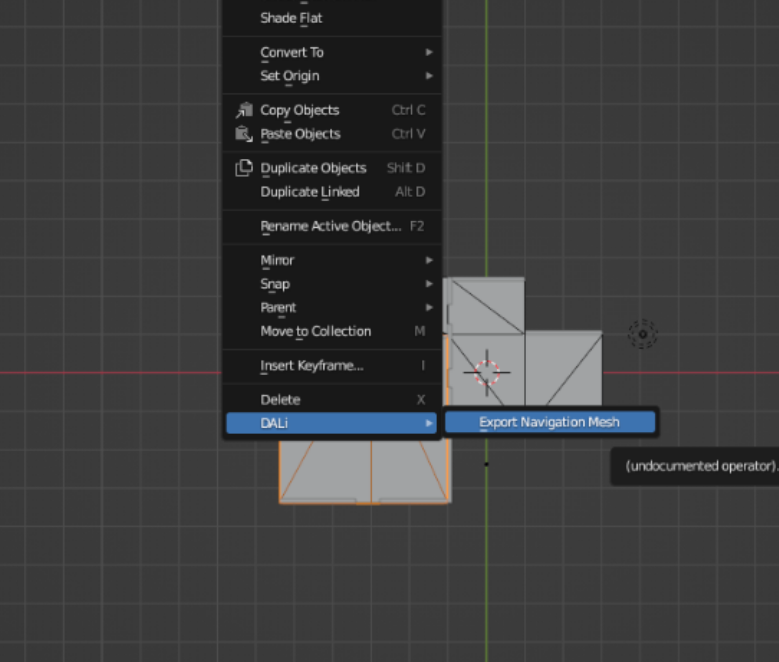

NavigationMeshExporter
======================

Script for Blender which allows exporting navigation (collision) mesh data.

Register new operator:
1. Open script in Blender (or copy paste as internal)
2. Execute
3. Nothing will happen but new operator will register

Usage:

1. Press RMB on the object to export
2. Go to "DALi" group
3. Select "Export Navigation Mesh"

